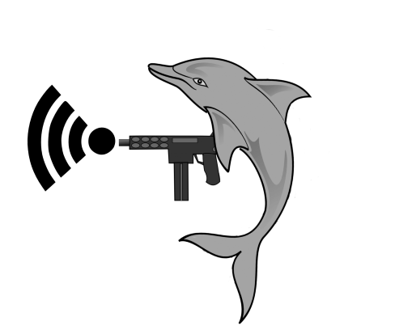

# An Apple Continuity Protocol Reverse Engineering Project

This is a project that seeks to understand the format
and structure of Apple's proprietary "Continuity" BLE protocol. 
It is a continuation of work conducted at the US Naval Academy during the fall
of 2018 and spring of 2019, culminating in a paper -- [Handoff All Your Privacy – A Review of Apple’s
Bluetooth Low Energy Continuity
Protocol](https://petsymposium.org/2019/files/papers/issue4/popets-2019-0057.pdf)
-- at the 2019 [Privacy Enhancing Technologies
Symposium](https://petsymposium.org/index.php) (PETS 2019) July 16–20, 2019 in
Stockholm, Sweden. While our paper investigates myriad privacy concerns arising
from Apple's use of the Continuity protocol across its ecosystem, including the
ability to track devices despite the use of randomized BD_ADDRs, this project is
focused on the reverse engineering of the Continuity protocol
we began in "Handoff All Your Privacy".

In particular, we were the first to describe the wire-format for many of the
following Continuity message types, and continue to update known field values as
new versions of iOS/macOS emerge. All of the other message types, and many of
the field meanings, were discovered by Guillaume Celosia and Mathieu Cunche in 
<a
href="https://petsymposium.org/2020/files/papers/issue1/popets-2020-0003.pdf">Discontinued
Privacy: Personal Data Leaks in Apple Bluetooth-Low-Energy Continuity
Protocols</a>.

- <a href="messages/airprint.md">AirPrint Message</a> 
- <a href="messages/airdrop.md">AirDrop Message</a> 
- <a href="messages/homekit.md">HomeKit Message</a> 
- <a href="messages/proximity_pairing.md">Proximity Pairing Message</a> 
- <a href="messages/hey_siri.md">"Hey Siri" Message</a> 
- <a href="messages/airplay_target.md">Airplay Target Message</a> 
- <a href="messages/airplay_source.md">Airplay Source Message</a> 
- <a href="messages/magic_switch.md">Magic Switch Message</a>
- <a href="messages/handoff.md">Handoff Message</a> 
- <a href="messages/tethering_target.md">Tethering Target Message</a> 
- <a href="messages/tethering_source.md">Tethering Source Message</a> 
- <a href="messages/nearby_action.md">Nearby Action Message</a> 
- <a href="messages/nearby_info.md">Nearby Info Message</a> 

## Wireshark Dissector

The latest Wireshark dissectors can be found <a href="dissector">here</a>, as
well as installation instructions <a href="dissector/INSTALL.md">here</a>.

## Contributing Dissector Updates

Apple updates Continuity frequently, adding both new fields and field values to
existing message types, as well as new message types entirely when new releases
of iOS and macOS are released. Help keep up to date by dropping us a line at <a
mailto="furiousmac@protonmail.com">furiousMAC@protonmail.com</a>

## ShmooCon 2020

The Continuity reverse engineering effort and Wireshark dissector were presented
at ShmooCon 2020 on January 31, 2020. The slides from the presentation are <a
href="shmoocon2020/shmoo20.pdf">here</a>.
