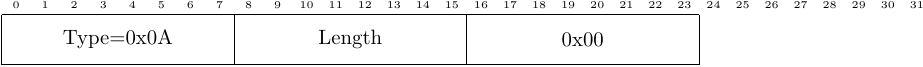

<h1>Airplay Source Message</h1>

 
Airplay Source messages are sent when a user has entered the menu to select a
device to play their media from when multiple media sources are available.
These messages have only one 1-byte field, which we have never observed
to be anything but 0x00. The message's purpose is unclear.

<!-- Leave this line -->

The message fields, observed values and their meaning:

<ul>
<li>
Type: 1 byte, 0x0A -- indicates an Airplay Source message
</li>
<li>
Length: 1 byte, 0x01 -- number of bytes in message
</li>
<li>
Data: 1 byte, 0x00 -- meaning unknown
</li>
</ul>
