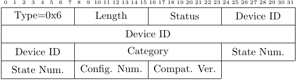

<h1>HomeKit Message</h1>

 
HomeKit is Apple's smart home framework, and HomeKit messages are broadcast
continuously by HomeKit compatible devices. This message type was first
described by Guillaume Celosia and Mathieu Cunche in 
<a
href="https://petsymposium.org/2020/files/papers/issue1/popets-2020-0003.pdf">Discontinued
Privacy: Personal Data Leaks in Apple Bluetooth-Low-Energy Continuity
Protocols</a>. Celosia <i>et al.</i> note that the Global State Number field
increments at each state change by a HomeKit device, which leaks information
about the device usage.

<!-- Leave this line -->

The message fields, observed values and their meaning:

<ul>
<li>
Type: 1 byte, 0x06 -- indicates a HomeKit message
</li>
<li>
Length: 1 byte, 0x0d -- number of bytes in message payload
</li>
<li>
Status flags: 1 byte
</li>
<li>
Device ID: 6 bytes
</li>
<li>
Category: 2 bytes
</li>
<li>
Global State Number: 2 bytes
</li>
<li>
Configuration Number: 1 byte
</li>
<li>
Compatible Version: 1 byte
</li>
</ul>
