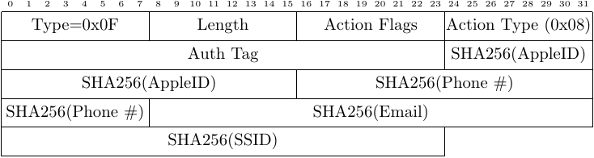

<h1>Nearby Action Message</h1>

 
Nearby Action messages are sent in order to inform nearby devices of a change in
device state, including joining a WiFi network or initial setup of an iOS
device. This message and its format were first described in 
<a
href="https://petsymposium.org/2019/files/papers/issue4/popets-2019-0057.pdf">Handoff
All Your Privacy &mdash; A Review of Apple's Bluetooth Low Energy Continuity
Protocol</a> by Martin <i>et al.</i> as a "WiFi-Join" message.
Guillaume Celosia and Mathieu Cunche enumerated the remaining `Action Types` in 
<a
href="https://petsymposium.org/2020/files/papers/issue1/popets-2020-0003.pdf">Discontinued
Privacy: Personal Data Leaks in Apple Bluetooth-Low-Energy Continuity
Protocols</a>.

The structure of the Nearby Action message's `Action Parameters` field is
dependent upon the `Action Type` value. One of the more common `Action Type`
values the FuriousMAC team observed was `WiFi Password (0x08)`, which prompts
nearby iOS devices to securely share a WiFi network's password if they are
already connected to the same network. This message type was originally
described in the <i>Handoff All Your Privacy</i> work as the "WiFi-Join"
message. The frame format of this particular message is given below; other
`Action Type` values will substitute `Action Type`-specific fields following 
the `Authentication Tag` field.

<!-- Leave this line -->

The message fields, observed values and their meaning:

<ul>
<li>
Type: 1 byte, 0x0F -- indicates a Nearby Action message
</li>
<li>
Length: 1 byte, variable -- number of bytes in message payload
</li>
<li>
Action Flags: 1 byte
</li>
<li>
Action Type: 1 byte
<ul>
<li>
0x01 -- Apple TV Setup
</li>
<li>
0x04 -- Mobile Backup
</li>
<li>
0x05 -- Watch Setup
</li>
<li>
0x06 -- Apple TV Pair
</li>
<li>
0x07 -- Internet Relay
</li>
<li>
0x08 -- WiFi Password
</li>
<li>
0x09 -- iOS Setup 
</li>
<li>
0x0A -- Repair
</li>
<li>
0x0B -- Speaker Setupd
</li>
<li>
0x0C -- Apple Pay
</li>
<li>
0x0D -- Whole Home Audio Setup
</li>
<li>
0x0E -- Developer Tools Pairing Request
</li>
<li>
0x0F -- Answered Call
</li>
<li>
0x10 -- Ended Call
</li>
<li>
0x11 -- DD Ping
</li>
<li>
0x12 -- DD Pong
</li>
<li>
0x13 -- Remote Auto Fill
</li>
<li>
0x14 -- Companion Link Proximity
</li>
<li>
0x15 -- Remote Management
</li>
<li>
0x16 -- Remote Auto Fill Pong
</li>
<li>
0x17 -- Remote Display
</li>
</ul>
</li>
<li>
Authentication Tag: 3 bytes
</li>
<li>
Action Parameters: Variable
</li>
</ul>
