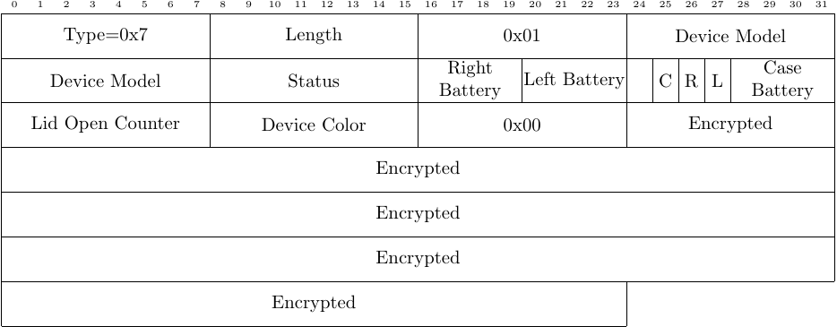

<h1>Proximity Pairing Message</h1>

 
Proximity Pairing is an Apple technology that is used to pair airPods and iOS
devices.  These messages carry unencrypted information detailing the status,
model, and color of the audio device as well as the power and charging status.

 

Proximity Pairing itself has been thoroughly reverse engineered by Guillaume
Celosia and Mathieu Cunche in  
<a
href="https://petsymposium.org/2020/files/papers/issue1/popets-2020-0003.pdf">Discontinued
Privacy: Personal Data Leaks in Apple Bluetooth-Low-Energy Continuity
Protocols</a>.

The message fields, observed values and their meaning:

<ul>
<li>
Type: 1 byte, 0x07 -- indicates a Proximity Pairing message
</li>
<li>
Length: 1 byte, variable -- number of bytes in the message
</li>
<li>
Undefined: 1 byte, 0x01
</li>
<li>
Device Model: 2 bytes
</li>
<li>
UTP/Status: 1 byte -- Indicates the position of the airPods (ear/case)
</li>
<li>
Battery Level: 1 byte -- airPod Battery Level Indicator, where the 4 MSBits are
the right battery and the 4 LSbits are the left battery.
</li>
<li>
Power Charging Status and Battery Case Level: 1 byte -- Battery case and the Left/Right
airPod Charging status, and the airPod case battery level
</li>
<li>
Lid Open Counter: 1 byte
</li>
<li>
Device Color: 1 byte
</li>
<li>
Undefined: 1 byte, 0x00
</li>
<li>
Encrypted Payload: 16 bytes
</li>
</ul>
